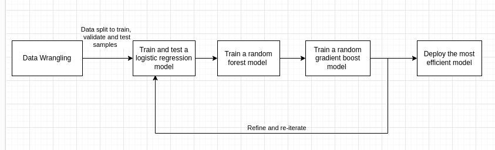

## Domain Background
This project aims to design a machine learning model that can optimize the best offer for a group of customers based on their preferences and behaviors. The data source for this project is a simulated dataset from Starbucks, the world’s largest coffeehouse company and a leader in customer loyalty programs. 

Starbucks launched its rewards program and mobile app to collect and analyze data about its customers and their purchasing habits. The data contains information about how customers respond to different types of promotional offers, such as buy-one-get-one (BOGO), discount, and informational offers. 

Each customer has some hidden and observable traits that affect their purchasing patterns and offer preferences. The data also records various events that customers produce, such as receiving, opening, and completing offers, as well as making purchases. The data does not track specific products, but only the amounts of each transaction or offer. The offers can be delivered through various channels, such as email, mobile, social, and web.

## Problem Statement
The goal of this project is to build a machine learning model that can predict if a customer will accept an offer. 
 The model will use the simulated data from Starbucks to learn the patterns and preferences of the customers and predict how they will react to various offers. 
The model will help Starbucks increase its revenue and customer loyalty by providing personalized and relevant offers to the customers.

## Solution Statement
The data of the three main files mentioned in Datasets and Inputs sections will be cleaned, transformed and denormalized to describe an offer. I will rely on the model accuracy and F1 scores to test & verify the model. Many machine learning algorithms (logistic regression, random forest and gradient boost) will be tried and then the best perfroming one will be picked. Hyperparameters tuning to be applied to achieve the best accuracy and F1-score.

## Datasets and Inputs

The dataset consists of 3 main files
1. profile.json: Rewards program users (17000 users x 5 fields)
    | Column | Dataype | Description
    | -------|---------|-----------
    | gender | categorical | M, F, O, or null
    | age    | numeric | missing value encoded as 118
    | id     | string/hash | 
    | became_member_on | date |  format YYYYMMDD
    | income | numeric
2. portfolio.json: Offers sent during 30-day test period (10 offers x 6 fields)
    | Column | Datatype |Description
    | -------|----------|------------
    | reward | numeric  | money awarded for the amount spent
    | channels| list    | web, email, mobile, social
    | difficulty| numeric | money required to be spent to receive reward
    | duration| numeric | time for offer to be open, in days
    | offer_type| string | bogo, discount, informational
    | id| string/hash |
3. transcript.json: Event log (306648 events x 4 fields)
    | Column | Datatype |Description
    | -------|----------|------------
    | person | string/hash |
    | event  | string | offer received, offer viewed, transaction, offer completed
    | value  | dictionary  different values depending on event type
    | offer id (value)| string/hash | not associated with any "transaction"
    | amount (value)| numeric | money spent in "transaction"
    | reward (value)| numeric | money gained from "offer completed"
    | time| numeric | hours after start of test
## Benchmark Model
I will use the logisitic regression model as the benchmark model of the predictive model for Starbucks' offers. 

## Evaluation Metrics
The model accuracy + F1 scores are the key metrics to be compared against the benchmark model.

## Project Design
