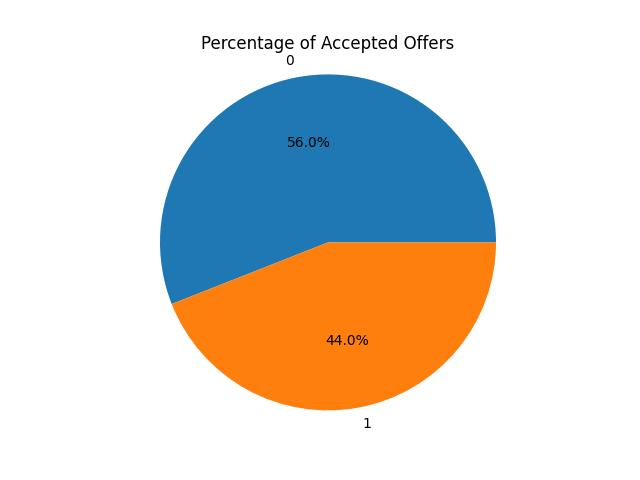
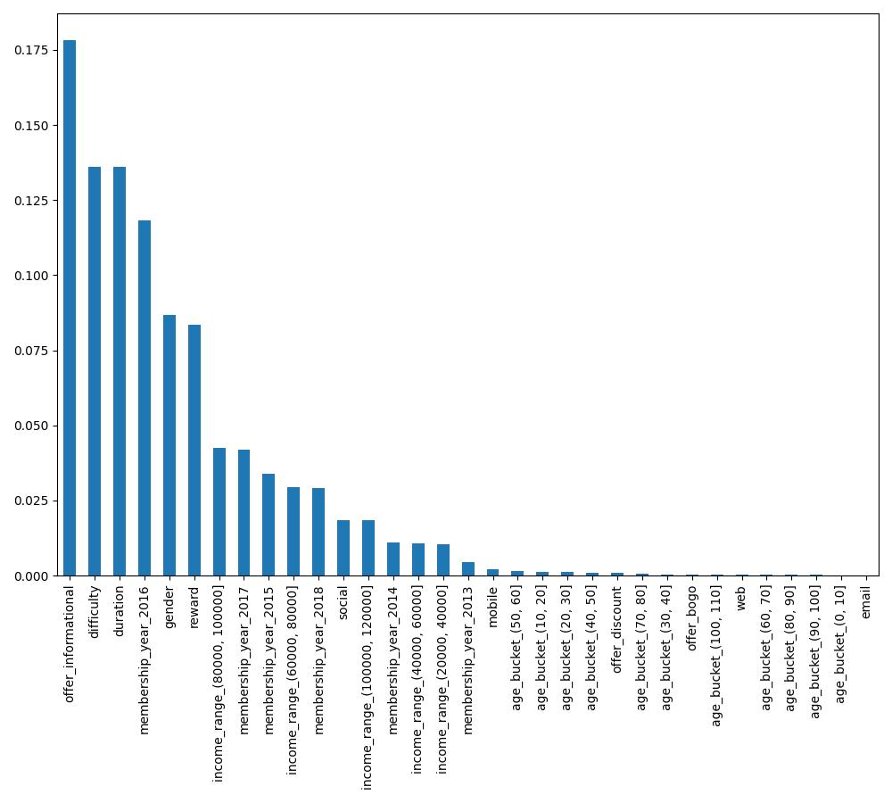

# Table of Contents
1. [Domain Background](#domain-background)
2. [Problem Statement](#problem-statement)
3. [Solution Statement](#solution-statement)
4. [Datasets and Inputs](#datasets-and-inputs)
5. [Data Preprocessing](#data-preprcoessing)
6. [Exploratory Data Analaysis](#exploratory-data-analysis)
7. [Implementation](#implementation)
8. [Predictive Models Results](#predictive-models-results)
9. [Refinement](#refinement)

## Domain Background 
This project aims to design a machine learning model that can optimize the best offer for a group of customers based on their preferences and behaviors. The data source for this project is a simulated dataset from Starbucks, the world’s largest coffeehouse company and a leader in customer loyalty programs. 

Starbucks launched its rewards program and mobile app to collect and analyze data about its customers and their purchasing habits. The data contains information about how customers respond to different types of promotional offers, such as buy-one-get-one (BOGO), discount, and informational offers. 

Each customer has some hidden and observable traits that affect their purchasing patterns and offer preferences. The data also records various events that customers produce, such as receiving, opening, and completing offers, as well as making purchases. The data does not track specific products, but only the amounts of each transaction or offer. The offers can be delivered through various channels, such as email, mobile, social, and web.

## Problem Statement
The goal of this project is to build a machine learning model that can predict if a customer will accept an offer. 
 The model will use the simulated data from Starbucks to learn the patterns and preferences of the customers and predict how they will react to various offers. 
The model will help Starbucks increase its revenue and customer loyalty by providing personalized and relevant offers to the customers.

## Solution Statement
The data of the three main files mentioned in Datasets and Inputs sections will be cleaned, transformed and denormalized to describe an offer.  I will rely on the model accuracy and F1 scores to test & verify the model. Many machine learning algorithms (logistic regression, random forest and gradient boost) will be tried and then the best perfroming one will be picked. Hyperparameters tuning to be applied to achieve the best accuracy and F1-score.

Overall, machine learning algorithms will be used to solve this classification problem (binary classification, either the offer is accpeted or not accepted) 

The following libraries are used:  
* `pandas`
* `numpy`
* `scikit`
* `matplotlib`

## Datasets and Inputs

The dataset consists of 3 main files
1. profile.json: Rewards program users (17000 users x 5 fields)
    | Column | Dataype | Description
    | -------|---------|-----------
    | gender | categorical | M, F, O, or null
    | age    | numeric | missing value encoded as 118
    | id     | string/hash | 
    | became_member_on | date |  format YYYYMMDD
    | income | numeric
2. portfolio.json: Offers sent during 30-day test period (10 offers x 6 fields)
    | Column | Datatype |Description
    | -------|----------|------------
    | reward | numeric  | money awarded for the amount spent
    | channels| list    | web, email, mobile, social
    | difficulty| numeric | money required to be spent to receive reward
    | duration| numeric | time for offer to be open, in days
    | offer_type| string | bogo, discount, informational
    | id| string/hash |
3. transcript.json: Event log (306648 events x 4 fields)
    | Column | Datatype |Description
    | -------|----------|------------
    | person | string/hash |
    | event  | string | offer received, offer viewed, transaction, offer completed
    | value  | dictionary  different values depending on event type
    | offer id (value)| string/hash | not associated with any "transaction"
    | amount (value)| numeric | money spent in "transaction"
    | reward (value)| numeric | money gained from "offer completed"
    | time| numeric | hours after start of test

## Data Preprcoessing

### Profile Dataset

`12%` of the profile data is inaccurate as they have neither `income` nor `gender` information and the `age` information does not make sense as well. So, these infected records are dropped.

As there are many non-numeric features, encoding techniques will be followed.

For `gender` column, the values will be mapped to:
* `M` to 0
* `F` to 1
* `O` to 2

For `age` column, although it is a numeric value, it is better to group the values in buckets to measure the impact of this feature on our problem. 
The `age_bucket` consists of groups: `[0,10)`, `[10, 20)`, `[20, 30)`, `[30, 40)`, `[40, 50)`, `[50, 60)`, `[60, 70)`, `[70, 80)`, `[80, 90)`, `[90, 100)`, `[100, 110)`

For `became_member_on` column, it will be converted to date and then the `year` part is extracted.

For `income` column, the same as `age` column, it is better to group in buckets of `20,000` based on the data distribution.

For `age_buckets`, `income` and `membership_year` one-hot encoding is applied to get the dataset ready for the machine learning models.

So that the final structure of the `profile` dataframe is:  
* `gender`
* `id`
* `age_bucket_(0, 10]`
* `age_bucket_(10, 20]`
* `age_bucket_(20, 30]`
* `age_bucket_(30, 40]`
* `age_bucket_(40, 50]`
* `age_bucket_(50, 60]`
* `age_bucket_(60, 70]`
* `age_bucket_(70, 80]`
* `age_bucket_(80, 90]`
* `age_bucket_(90, 100]`
* `age_bucket_(100, 110]`
* `membership_year_2013` 
* `membership_year_2014` 
* `membership_year_2015`
* `membership_year_2016` 
* `membership_year_2017` 
* `membership_year_2018`
* `income_range_(20000, 40000]`
* `income_range_(40000, 60000]`
* `income_range_(60000, 80000]`
* `income_range_(80000, 100000]`
* `income_range_(100000, 120000]`

### Portfolio Dataset

This dataset contains the information of the offers.

All the values of the column `channels` is grouped and became distinct, then one-hot encoding applied.

The same encoding technique is applied to `offer_type`. 

So that the final structure of the `portfolio` dataset is: 
* `reward`
* `difficulty `
* `duration `
* `id` 
* `email` 
* `mobile`
* `social`
* `web `
* `offer_bogo`
* `offer_discount`
* `offer_informational`

### Transcript Dataset

This dataset contains both offers and transactions information, in the scope of our project, the transactions data will be omitted. 

Then the offers dataset will hold the offer - customer association data, only when `event` is in `[offer received, offer viewed, offer completed]` 

This dataset may have duplicates, as the offer may be forwarded to the same customer many times.

Once again, the one-hot encoding technique will be applied on `event` column, then all the customer and offer information will be added to this dataframe `offers`, in other words, the dataframes are denormalized in a single dataset that will be used for machine learning algorithms.  

So that the final structure of the `offers` dataframe is: 
* `offer_accepted`
* `offer_id`
* `gender`
* `age_bucket_(0, 10]`
* `age_bucket_(10, 20]`
* `age_bucket_(20, 30]`
* `age_bucket_(30, 40]`
* `age_bucket_(40, 50]`
* `age_bucket_(50, 60]`
* `age_bucket_(60, 70]`
* `age_bucket_(70, 80]`
* `age_bucket_(80, 90]`
* `age_bucket_(90, 100]`
* `age_bucket_(100, 110]`
* `membership_year_2013`
* `membership_year_2014`
* `membership_year_2015`
* `membership_year_2016`
* `membership_year_2017`
* `membership_year_2018`
* `income_range_(20000, 40000]`
* `income_range_(40000, 60000]`
* `income_range_(60000, 80000]`
* `income_range_(80000, 100000]`
* `income_range_(100000, 120000]`
* `reward`
* `difficulty`
* `duration`
* `email`
* `mobile`
* `social`
* `web`
* `offer_bogo`
* `offer_discount`
* `offer_informational`

## Exploratory Data Analysis

Based on the exploratory data analysis, I have found that both offers with IDs `3f207df678b143eea3cee63160fa8bed` & `9b98b8c7a33c4b65b9aebfe6a799e6d9` have never been accepted by any customer in our datasets.

* `3f207df678b143eea3cee63160fa8bed` This was an informational offer, however no customer has accepted it.
* `9b98b8c7a33c4b65b9aebfe6a799e6d9` This was a buy-one-get-one offer, but also no customer has accepted it.
---
`56%` of the offers in this campagin were not selected by any customer 

## Implementation

During this project, three machine learning models were utilized.  During the implementation, `radnom_state` has been set to `42`. 
 The `random_state` parameter in scikit-learn is used for initializing the internal random number generator, which will decide the splitting of data into train and test indices in our case.
`random_state` parameter is important when we need reproducibility of the code so that we can we get the same results whenever the code is run.

* `Logistic Regression` 
The `liblinear` solver was used as a classifer, as the dataset is relatively small. One challgenge was met in this part, the default solver `lbfgs` gave poor results, the `liblinear` solver fits here as the dataset is relatively small.

For the **advanced machine learning** models such as `Random Forest` and `Gradient Boosting`
Using metrics like `F1 score` and `Accuracy` are crucial in evaluating the performance of machine learning models. Here’s why: 

`Accuracy`: This is one of the most straightforward metrics. It computes how many times a model made a correct prediction across the entire dataset. However, accuracy can be misleading if the dataset is imbalanced, i.e., when the number of samples in different classes varies significantly. For example, in a binary classification problem, if 90% of the samples belong to Class A and only 10% belong to Class B, a model that always predicts Class A will still have an accuracy of 90%.

`F1 Score`: The F1 score is a more robust metric, especially for imbalanced datasets. It combines precision and recall into a single value. Precision represents the accuracy of positive predictions, while recall represents how well a model can identify actual positive cases. The F1 score is the harmonic mean of precision and recall, providing a balance between these two metrics. It ranges from 0 to 1, with 1 indicating the best possible performance.  

So it is important to use both scores together.

* `Random Forest`  
With setting only one hyperparameter `n_estimator`= `100`

* `Gradient Boosting` 
With setting the following hyperparameters: 
i. `n_estimator`=`100`  
ii. `learning_rate`=`1.0` 
iii. `max_depth` = `1` 

## Predictive Models Results

Before applying any hyperparameters tunning, these were the results.

| Algorithm |F1 Score | Accuracy Score |
|-------------------|----------|----------------|
| Logistic Regression | 0.7587440097274873 | 0.778906659674882 |
| Random Forest       | 0.7454201802849666 | 0.7704509701101206 |
| Gradient Boosting   | 0.7582409724705041 | 0.7783822758259046 |

The `Logistic Regression` outperformed, this maybe because the hyperparameters configured for `Random Forest` and `Gradient Boosting` models.
Other reasons may be the reason behind that, the dataset is relatively small and may the relation between the features and target is linear.

## Refinement

To refine the results, I have used `GridSearchCV` tool and passed these ranges for the `Random Forest` model:  `rf_params = {
    'n_estimators': [50, 100, 200],
    'max_depth': [None, 10, 20, 30],
    'min_samples_split': [2, 5, 10]
}
` 

And passed these ranges for `Gradient Boosting` model: 
`gb_params = {
    'n_estimators': [50, 100, 200],
    'learning_rate': [0.01, 0.1, 1.0],
    'max_depth': [3, 5, 10]
}
`

`GridSearchCV` tool performs an exhaustive search over the specified parameter values for an estimator. The parameters of the estimator used to apply these methods are optimized by cross-validated grid-search over a parameter grid.

After tunning the hyperparameters, The Gradient Boosting Model, using the below hyperparameters slightly outperforms the others:
* `learning_rate`: `0.1`
* `max_depth`: `5`
* `n_estimators`: `50`

| Algorithm |F1 Score | Accuracy Score |
|-------------------|----------|----------------|
| Logistic Regression | `0.7587440097274873` | `0.778906659674882` |
| Random Forest       | `0.7615290826938249` | `0.7820529627687467` |
| Gradient Boosting   |  0.7578039330360407  |  0.7828395385422129|

`offer_informational` is the most important feature used by the Gradient Boosting model 
`difficuly` offer difficulty reflects the amount spent by the customer 
`duration` reflects the duration of the offer 
`membership_year_2016` customers joined in 2016 

In future, passing only the top important features, mentioned above, to the Gradient Boosting model can result in more accuracy and F1 score results.